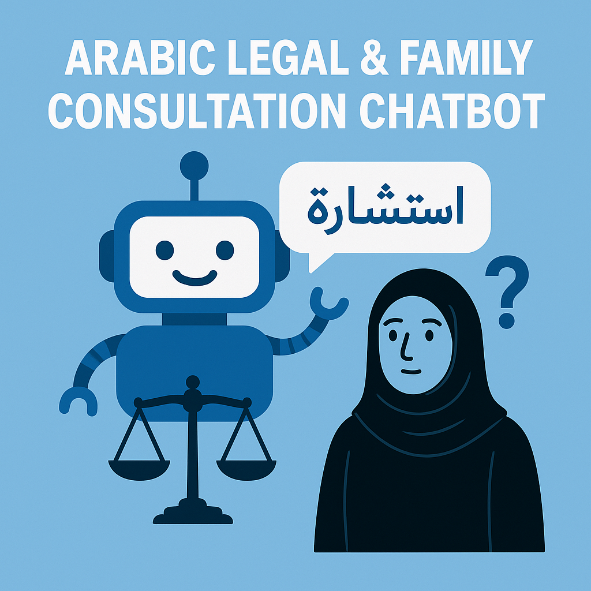

# 🤖 Arabic Legal & Family Consultation Chatbot


An Arabic-language chatbot designed to assist users in obtaining **family and legal consultations** using natural language processing (NLP) techniques. Built with a smart escalation mechanism for complex queries, and a user-friendly interface powered by **Streamlit**.

---

## 🧠 Project Overview

This project implements an Arabic question-answering chatbot that processes user queries and responds intelligently in Modern Standard Arabic. It supports uploading documents (PDF, DOCX, TXT), extracting and vectorizing their content, and answering questions based on that content using OpenAI's GPT models. A human escalation system is built-in for cases requiring expert intervention.

---

## 🌟 Features

- ✅ Understands Arabic (Modern Standard Arabic) with partial support for common phrases.
- 📂 Upload and analyze legal/family-related documents.
- 🔄 Escalation to a **human consultant** when needed.
- 🔐 Role-based access: Admin and regular users.
- 💬 Intelligent, Arabic-language responses powered by OpenAI.
- 🖥️ Fast and flexible user experience via Streamlit UI.

---

## 🚀 Getting Started

### Requirements

- Python 3.8+
- Ubuntu/Debian (recommended) or any OS with Python
- OpenAI API key

---

### Installation

1. **Clone the repository**
   ```bash
   git clone https://github.com/yourusername/arabic-qa-chatbot.git
   cd arabic-qa-chatbot
